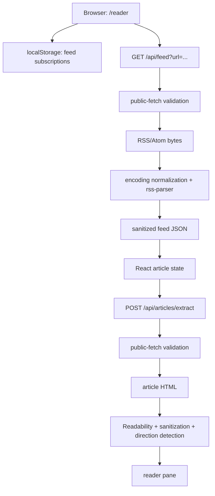

# Architecture

## Summary

Al-Rawi is a single Next.js App Router application. The landing and reader
surfaces are client components. The reader stores only feed subscription
metadata locally, then calls two Node.js route handlers to fetch public feed XML
or public article HTML. Parsing, encoding normalization, extraction, and
sanitization happen in server-side libraries; article state remains in the
reader page’s React state.

## Module map

| Module | Responsibility |
|---|---|
| `src/app/page.tsx` | Re-exports the landing page as the root route. |
| `src/app/landing/page.tsx` | Bilingual landing experience. |
| `src/app/reader/page.tsx` | Reader orchestration and in-memory state. |
| `src/components/` | Reader panes, dialogs, providers, and UI primitives. |
| `src/hooks/use-keyboard-nav.ts` | Global J, K, O, M, `/`, and R reader shortcuts outside editable controls. |
| `src/lib/local-reader.ts` | Feed subscription serialization and validation. |
| `src/lib/public-fetch.ts` | Public URL validation, DNS checks, redirect and byte limits, timeout. |
| `src/lib/feed-parser.ts` | RSS/Atom parsing, article mapping, sanitization. |
| `src/lib/encoding-normalizer.ts` | UTF-8 and legacy Arabic encoding handling plus direction/language detection. |
| `src/lib/content-extractor.ts` | Mozilla Readability extraction and sanitized article output. |
| `src/lib/opml-parser.ts` | Server-side OPML parse/generate utility; Settings also contains a browser-side parser. |

## Main data flow

## External boundaries and controls

- The app makes outbound requests only through the two same-origin route
  handlers for reader operations.
- `fetchPublicResource` accepts only HTTP(S), rejects private hostnames and
  private/reserved IP ranges, validates redirect destinations, allows at most
  three redirects, applies a 15-second timeout, and enforces a byte limit per
  request.
- Feed responses are limited to 4 MB. Article HTML responses are limited to
  8 MB and must have an HTML content type.
- Feed and extracted article HTML are sanitized before the client renders it.

## Risks and coupling

- Reader freshness depends on the availability and shape of third-party RSS and
  article sources.
- Local-only state means clearing browser storage removes subscriptions; the
  current session’s articles are not recoverable after reload.
- Public-fetch and sanitization changes affect both external-request safety and
  content rendering; review them together.
- There is no automated test suite in the repository. `Unknown / verify` for
  regression coverage around parsers, sanitization, and route validation.
